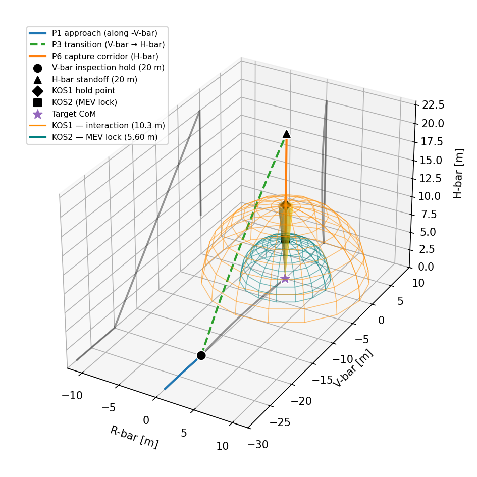
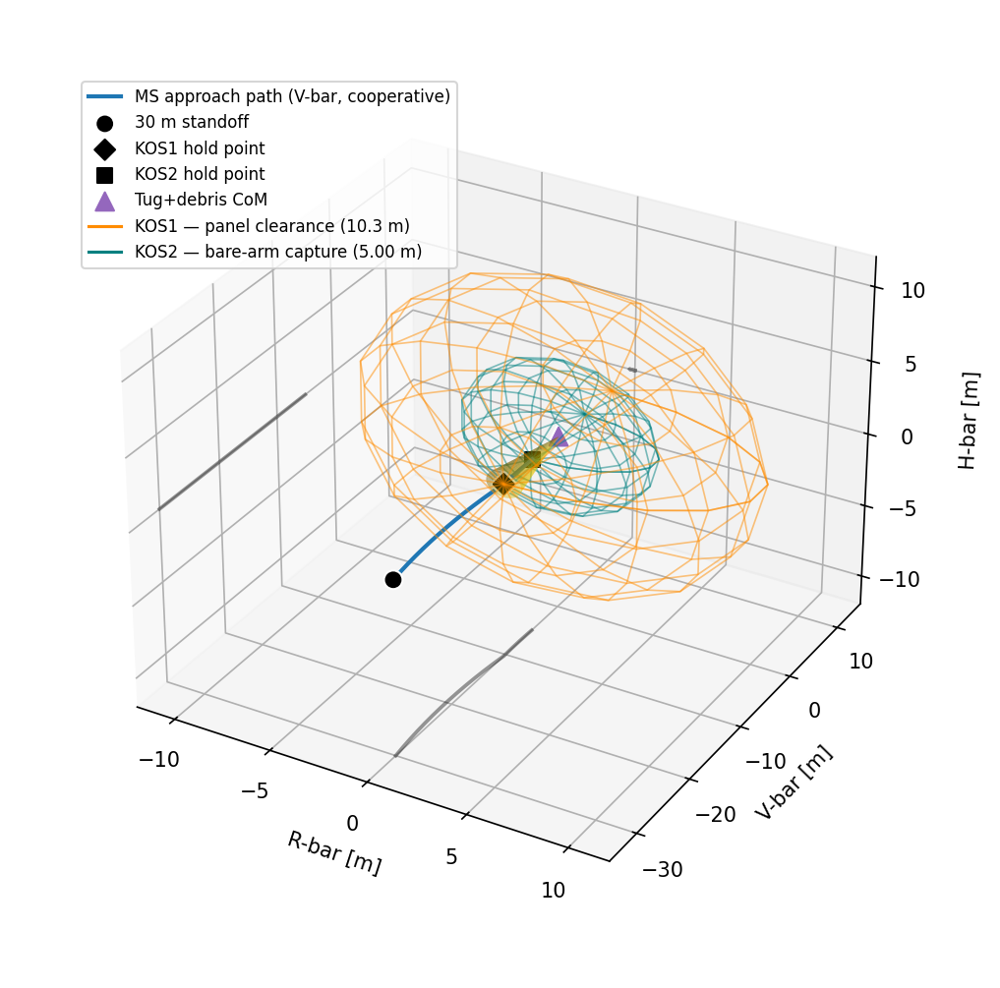
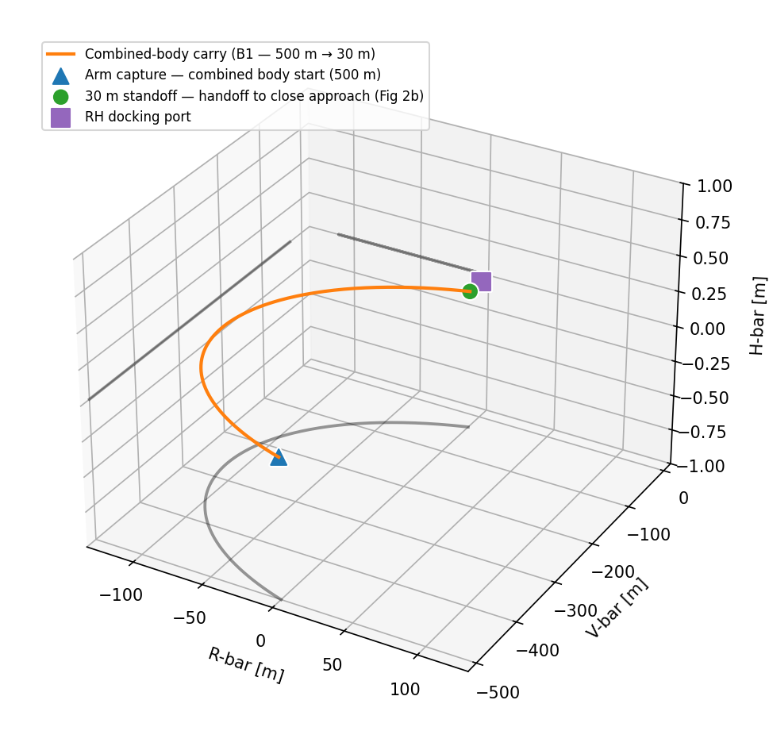
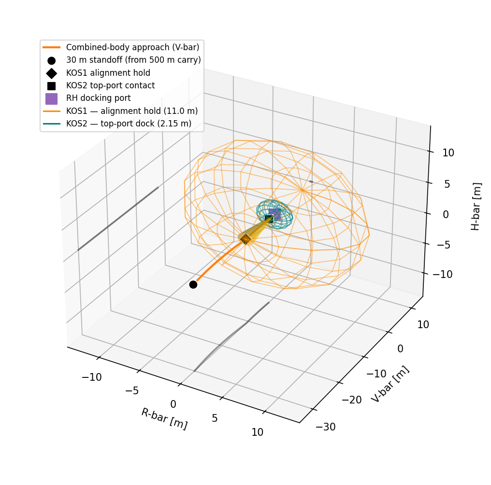

# REAVER — Rendezvous & Proximity Operations (RPO) Analysis

## 1. Introduction

The REAVER mothership (MS) performs close-range RPO twice per debris in the
mission: once to **capture** a tumbling debris object, and once per cycle to
**hand it over** at the cooperative Recycling Hub (RH). These maneuvers set the
close-range ΔV budget (the long-range orbit transfers are sized separately by
the mission optimizer) and drive the AOCS sizing.

This report walks through the two RPO campaigns — **Part 1: Debris RPO** and
**Part 2: RH docking cycle** — using four trajectory figures. Each maneuver is a
sequence of short translations between hold points, plus the attitude work
(spin-up, momentum dump, re-point). The figures are the primary explanation aid;
the tables give the per-phase numbers and the equations close the loop on how
each number is produced.

All trajectories are shown in the **Hill (LVLH) frame** of the relevant target:
**R-bar** (radial), **V-bar** (along-track), **H-bar** (cross-track).

---

## 2. Assumptions

| # | Assumption |
|---|------------|
| 1 | Relative motion is the linearised **Clohessy–Wiltshire** model about a circular GEO orbit, mean motion `n = √(µ/a³) ≈ 7.11×10⁻⁵ rad/s`. |
| 2 | Each translation is a **rest-to-rest two-impulse CW transfer**; transfer time is sized so the mean speed ≈ ½·V_MAX, with **V_MAX = 0.05 m/s** (low-impact docking limit). |
| 3 | Burns are **impulsive**; propellant follows **Tsiolkovsky** with the MS monopropellant `Isp = 253 s` → `vₑ = 2481 m/s`. |
| 4 | Attitude is delivered by **24 RCS thrusters** (4 N each). The detumble/slew couple uses one opposed edge pair: `τ = 2·(3·4 N)·1.05 m = 25.2 N·m`. Momentum-dump propellant `= H/(arm·vₑ)` is independent of thruster count. |
| 5 | Reference debris is **COMSATBW-1** (2440 kg, 17.2 m panel span), tumbling at **6 °/s (1 rpm)** — the REQ-MIS-06 ceiling and the AOCS-dimensioning case. |
| 6 | Inertia tensors are **box models**: MS 3.0×3.0×3.5 m, tug 0.75×0.75×1.2 m, debris bus 2.5×2.5×3.0 m + panels. |
| 7 | **Keep-out spheres (KOS)** centred on the target: `KOS1 = (panel span/2)·1.20`; `KOS2` from hardware geometry (see §5). |
| 8 | **Re-point/settle slew rates** are bounded by V_MAX at the payload tip (`ω ≈ V_MAX/r`): **0.5 °/s** for the dock re-point, **0.2 °/s** for the clamp settle. Costed as a single momentum build (spin-up). |
| 9 | The RH is **cooperative** (known state, fixed docking axis): no spin-synchronisation, only a ~30 min go/no-go dwell. |
| 10 | A **+50 % abort margin** is applied to the nominal debris-RPO ΔV (not to the detumble line). |
| 11 | **TBD (flagged):** robotic-arm length (5.0 m placeholder), RH structural size, and debris panel orientation during the RH dock. |

---

## 3. RPO Phases

### Part 1 — Debris RPO (Fig 1)

The debris is **uncooperative** — silent, tumbling, no fixed docking axis — so the
MS cannot simply pick an approach corridor. It must first **observe the target
from a stable hold**, and only then approach along the tumble axis it has measured.
The hold is on **V-bar**, the only naturally fixed CW hold point (a body at rest at
an along-track offset stays put; an H-bar offset would oscillate back through the
plane). The capture corridor is then flown along the **identified tumble axis**
(modelled as H-bar).

**Fig 1.** Debris RPO in the target Hill frame, two stages: (1) **blue** — approach
along −V-bar to the **V-bar inspection hold** (20 m), where spin rate and tumble
axis are measured and go/no-go is given; (2) **green** — transition around the
keep-out sphere onto the tumble axis; (3) **orange** — capture corridor down the
tumble axis through **KOS1** (10.3 m, panel clearance) → **KOS2** (5.6 m, MEV lock),
inside the 5° terminal cone (gold). KOS1/KOS2 are the orange/teal spheres.

- **P1 Approach:** cut-off (150 m) → 20 m **V-bar** inspection hold.
- **P2 Inspection:** 8 h dwell on the stable V-bar hold — **measure spin rate +
  tumble axis**, ground go/no-go (you must know the axis before approaching it).
- **P3 Transition:** reposition around the keep-out sphere onto the identified
  tumble axis (H-bar), then close to KOS1.
- **P4 Arm extension:** deploy the arm + tug at KOS1 (before spin-up).
- **P5 Spin-sync:** spin the deployed assembly up to match the measured tumble
  (the spin-up + the arm's inertia growth sum to the same total either way).
- **P6 MEV lock + detumble:** final KOS1→KOS2 approach, then the **combined-body
  momentum dump** — the single largest ΔV line and the AOCS sizing case.
- **P7 Retreat:** MS backs off to a safe standoff after tug release.

### Part 2, Phase A — Tug Meet (Fig 2a)

At the RH the MS first **meets the cooperative tug+debris** and clamps it with
the bare robotic arm. Because the target is cooperative, the approach is a direct
**V-bar** corridor (no H-bar detour, no spin-sync).

**Fig 2a.** Tug-meet close approach in the tug+debris Hill frame: 30 m standoff →
**KOS1** (10.3 m, panel clearance) → **KOS2** (5.0 m, **bare arm length** — no tug
on the MS arm yet, so tug/2 is *not* added). Same 5° corridor as Fig 1.

### Part 2, Phase B — RH Dock (Fig 2c then Fig 2b)

The MS now carries the combined body (MS + **extended arm + tug + debris**) back
to the RH and hard-docks via a dedicated port on **top** of the bus — the arm
stays extended, holding the payload to the side. This is split into a far-range
**carry** and a **close approach**.

**Fig 2c.** Far-range carry (B1): the combined body translates from the 500 m
capture hold to the 30 m standoff. The R-bar excursion is the natural CW coasting
arc; the green marker is the handoff to the close approach.

**Fig 2b.** Close approach + hard-dock in the RH-port frame: 30 m → **KOS1_DOCK**
(11.0 m, sized to clear the extended payload) → **KOS2_DOCK** (2.15 m, MS top-port
contact). Between B1 and the close approach, the heavy off-axis payload forces a
**re-point slew** (B2) to aim the top port at the RH — the dominant Phase-B cost.

---

## 4. Results

ΔV is independent of mass for translations (geometry-driven); propellant below is
for the reference chaser mass of each part. **Mission constants** (per event):
`DV_RPO_DEBRIS = 0.65`, `DV_RPO_DETUMBLE = 1.33`, `DV_RPO_TUG_MEET = 0.14`,
`DV_RPO_RH_DOCK = 0.27`, `DV_RPO_RH = 0.41` m/s.

### Table 1 — Part 1: Debris RPO (chaser 3228 kg, 6 °/s)

| Phase | ΔV [m/s] | Prop [kg] | Time |
|-------|---------:|----------:|-----:|
| P1 Approach (cut-off → V-bar hold) | 0.051 | 0.066 | 86.7 min |
| P2 Inspection (V-bar hold: spin + axis) | 0.005 | 0.006 | 8.0 h |
| P3 Transition to tumble axis (→ KOS1) | 0.100 | 0.130 | 25.3 min |
| P4 Arm extension (deploy + lock onto tug) | 0.011 | 0.015 | 1.5 min |
| P5 Spin-sync (match tumble) | 0.168 | 0.219 | 0.4 min |
| P6a Final approach (KOS1 → KOS2) | 0.050 | 0.065 | 3.2 min |
| P6b Momentum dump (**detumble**) | 1.334 | 2.017 | 3.5 min |
| P7 Retreat (KOS2 → safe) | 0.050 | 0.065 | 9.6 min |
| **DV_RPO_DEBRIS** (nominal ×1.50 abort) | **0.653** | 0.850 | — |
| **DV_RPO_DETUMBLE** (no abort margin) | **1.334** | 2.017 | — |

### Table 2 — Part 2 Phase A: Tug Meet (MS 1884 kg)

| Phase | ΔV [m/s] | Prop [kg] | Time |
|-------|---------:|----------:|-----:|
| A1 Close approach (30 m → KOS1) | 0.050 | 0.038 | 13.1 min |
| A2 KOS1 hold (synch + comm) | 0.000 | 0.000 | 30.0 min |
| A3 Capture run (KOS1 → KOS2 = arm) | 0.050 | 0.038 | 3.6 min |
| A4 Arm extend + dock (CoM shift) | 0.044 | 0.067 | 2.0 min |
| **DV_RPO_TUG_MEET** | **0.145** | 0.143 | — |

### Table 3 — Part 2 Phase B: RH Dock (MS 1884 kg + payload)

| Phase | ΔV [m/s] | Prop [kg] | Time |
|-------|---------:|----------:|-----:|
| B1 Carry (500 m hold → 30 m) — *Fig 2c* | 0.054 | 0.099 | 313.3 min |
| B2 Re-point (combined inertia slew) | 0.111 | 0.168 | 2.0 min |
| B3 Close approach (30 m → KOS1) — *Fig 2b* | 0.050 | 0.091 | 12.6 min |
| B4 KOS1 hold (align + go/no-go) | 0.000 | 0.001 | 30.0 min |
| B5 Hard-dock (KOS1 → KOS2, top port) | 0.050 | 0.091 | 5.9 min |
| **DV_RPO_RH_DOCK** | **0.266** | 0.449 | — |

---

## 5. Relevant Equations

**Mean motion (CW dynamics):**
`n = √(µ / a³)` — at GEO ≈ 7.11×10⁻⁵ rad/s.

**Translation — two-impulse CW transfer:** solve the state-transition matrix for
the impulse that lands on the target after free drift,
`Φ_rv · v₀⁺ = r_f − Φ_rr · r₀`, then `ΔV = |Δv₁| + |Δv₂|`, with transfer time
`t = chord / (0.5·V_MAX)`.

**Stationkeeping / dwell:** `ΔV = a_dist · t`, where
`a_dist = C_R·(A/m)·P_sol + a_triax` (solar pressure + GEO triaxiality).

**Attitude (detumble, spin-sync, re-point):** angular momentum `H = |J·ω|`;
propellant `m_p = H / (arm·vₑ)`; equivalent `ΔV = vₑ·ln(m / (m − m_p))`; slew time
`t = H / (2·F_edge·arm)`. Slew rate is capped by the docking limit: `ω ≈ V_MAX / r`.

**Propellant (every phase):** `m_p = m₀·(1 − e^(−ΔV/vₑ))`, `vₑ = Isp·g₀`.

**Keep-out spheres:**
- `KOS1 = (panel span / 2) · 1.20` (per-target, panel clearance)
- `KOS2 (debris)  = arm + tug/2` = 5.60 m (tug-on-arm reaches debris)
- `KOS2 (tug meet) = arm`        = 5.00 m (bare arm reaches the tug)
- `KOS2 (dock)    = MS height/2 + port` = 1.75 + 0.40 = 2.15 m (top-port contact)
- `KOS1 (dock)    = (arm + tug + bus) · 1.20` ≈ 11.0 m (extended-payload envelope)

---

*Figures included: **Fig 1** (§3 Part 1, Table 1), **Fig 2a** (§3 Phase A, Table 2),
**Fig 2c** and **Fig 2b** (§3 Phase B, Table 3). Generated by `rpo_plots.py`;
numbers by `rpo_run.py`.*
